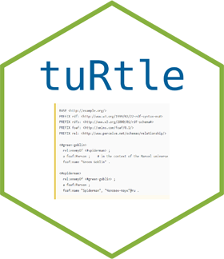

<!-- README.md is generated from README.Rmd. Please edit that file -->

```{r setupknitr, include = FALSE}
knitr::opts_chunk$set(
  collapse = TRUE,
  comment = "#>",
  fig.path = "man/figures/",
  out.width = "100%"
)
```

# tuRtle <a href='https://turtle.dataobservatory.eu/'></a>

<!-- badges: start -->
[](https://lifecycle.r-lib.org/articles/stages.html#experimental)
[](https://www.repostatus.org/#wip)
[](https://dataobservatory.eu/)
[](https://zenodo.org/records/10576998)
<!-- badges: end -->

The goal of tuRtle is to parse or export R data with the Turtle syntax for the Resource Description Framework (RDF). This is a very early version that is being co-developed with the [dataset](https://dataset.dataobservatory.eu/) package.

## Installation

You can install the development version of tuRtle with `remotes::install_github()`:

```{r installation, eval=FALSE}
remotes::install_github("dataobservatory-eu/tuRtle", build = FALSE)
```

## Example

Let us organise statements into a table of *s* subject, *p* predicate and *o* object:

```{r tdfdef, results='asis'}
tdf <- data.frame (s = c("eg:01","eg:02",  "eg:01", "eg:02", "eg:01" ),
                   p = c("a", "a", "eg-var:", "eg-var:", "rdfs:label"),
                   o = c("qb:Observation",
                         "qb:Observation",
                         "\"1\"^^<xs:decimal>",
                         "\"2\"^^<xs:decimal>", 
                         '"Example observation"')
                   )

knitr::kable(tdf)
```

The Turtle serialisation is this, written into an `example_file`. The parameter `ttl_namespace = NULL` results in using the default prefixes of the dataset package.

```{r ttl_example}
library(tuRtle)
example_file<- file.path(tempdir(), "example_ttl.ttl")
ttl_write(tdf=tdf, ttl_namespace = NULL, file_path = example_file)

readLines(example_file)
```

## Code of Conduct

Please note that the tuRtle project is released with a [Contributor Code of Conduct](https://dataobservatory-eu.github.io/tuRtle/CODE_OF_CONDUCT.html). By contributing to this project, you agree to abide by its terms.

